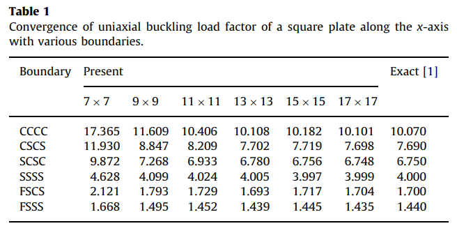
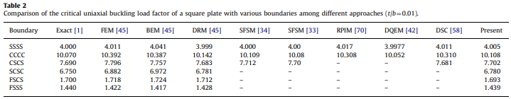

# Bui Table 1/2 屈曲算例重現

本報告採用 Bui Table 1/2 的測試規格，但 `Present` 欄位改用本專案公式重新計算。目的在於檢查同一組幾何、邊界、節點與載重條件下，本文 Mindlin 板屈曲弱式得到的臨界屈曲係數。

Table 1/2 使用方板：

```math
a=b,\qquad h/b=0.01,\qquad
E=200\times10^9,\qquad \nu=0.3,\qquad k_s=5/6
```

邊界順序採 `Γ1=bottom`、`Γ2=right`、`Γ3=top`、`Γ4=left`，再轉換到程式內部的邊界順序。

## 公式

本節依 `md/test2.md` 的內容整理。Mindlin 板位移場為

```math
\bar{u}_{\alpha}(x_1,x_2,x_3)
=u_{\alpha}(x_1,x_2)-x_3\phi_{\alpha},
\qquad
\bar{u}_3=w .
```

應變、曲率與剪切應變為

```math
\epsilon_{\alpha\beta}
=\varepsilon_{\alpha\beta}+x_3\kappa_{\alpha\beta},
\qquad
\varepsilon_{\alpha\beta}
=\frac{1}{2}(u_{\alpha,\beta}+u_{\beta,\alpha}),
```

```math
\kappa_{\alpha\beta}
=-\frac{1}{2}(\phi_{\alpha,\beta}+\phi_{\beta,\alpha}),
\qquad
\gamma_\alpha=w_{,\alpha}-\phi_\alpha .
```

材料關係與合力為

```math
\sigma_{\alpha\beta}
=D_{\alpha\beta\gamma\eta}\epsilon_{\gamma\eta},
\qquad
\tau_{3\alpha}=G\gamma_\alpha ,
```

```math
M_{\alpha\beta}
=\frac{h^3}{12}D_{\alpha\beta\gamma\eta}\kappa_{\gamma\eta},
\qquad
Q_\alpha=k_sGh\gamma_\alpha .
```

弱式為

```math
\int_\Omega
\left(
M_{\alpha\beta}\delta\kappa_{\alpha\beta}
+Q_\alpha\delta\gamma_\alpha
-P_{\alpha\beta}w_{,\alpha}\delta w_{,\beta}
\right)d\Omega=0 .
```

也就是

```math
a_b(\boldsymbol\phi,\delta\boldsymbol\phi)
+a_s((w,\boldsymbol\phi),(\delta w,\delta\boldsymbol\phi))
-a_g(w,\delta w)=0 .
```

形函數離散：

```math
w^h=\sum_KN_Kw_K,\qquad
\phi_x^h=\sum_KN_K\phi_{xK},\qquad
\phi_y^h=\sum_KN_K\phi_{yK}.
```

彎曲剛度：

```math
a_b(\boldsymbol\phi,\delta\boldsymbol\phi)
=\int_\Omega \frac{h^3}{12}
D_{\alpha\beta\gamma\eta}
\kappa_{\alpha\beta}\delta\kappa_{\gamma\eta}\,d\Omega
=\sum_{R,S}\delta\phi_{iR}
(K_{\phi\phi,RS}^b)_{ij}\phi_{jS}.
```

```math
\begin{aligned}
(K_{\phi\phi,RS}^b)_{11}
&=\frac{h^3}{12}\int_\Omega
(D_{1111}N_{R,x}N_{S,x}
+D_{1212}N_{R,y}N_{S,y})d\Omega,\\
(K_{\phi\phi,RS}^b)_{12}
&=\frac{h^3}{12}\int_\Omega
(D_{1122}N_{R,x}N_{S,y}
+D_{1212}N_{R,y}N_{S,x})d\Omega,\\
(K_{\phi\phi,RS}^b)_{21}
&=\frac{h^3}{12}\int_\Omega
(D_{1122}N_{R,y}N_{S,x}
+D_{1212}N_{R,x}N_{S,y})d\Omega,\\
(K_{\phi\phi,RS}^b)_{22}
&=\frac{h^3}{12}\int_\Omega
(D_{1212}N_{R,x}N_{S,x}
+D_{1111}N_{R,y}N_{S,y})d\Omega .
\end{aligned}
```

剪切剛度由

```math
a_s((w,\boldsymbol\phi),(\delta w,\delta\boldsymbol\phi))
=\int_\Omega k_sGh\,\gamma_\alpha\delta\gamma_\alpha\,d\Omega
```

拆成四個區塊：

```math
K_{ww,KL}^s
=k_sGh\int_\Omega
(N_{K,x}N_{L,x}+N_{K,y}N_{L,y})d\Omega,
```

```math
K_{\phi\phi,KL}^s
=k_sGh\int_\Omega N_KN_L\,d\Omega\,I_2,
```

```math
(K_{w\phi,KL}^s)_1
=-k_sGh\int_\Omega N_{K,x}N_L\,d\Omega,
\qquad
(K_{w\phi,KL}^s)_2
=-k_sGh\int_\Omega N_{K,y}N_L\,d\Omega,
```

```math
(K_{\phi w,KL}^s)_1
=-k_sGh\int_\Omega N_KN_{L,x}\,d\Omega,
\qquad
(K_{\phi w,KL}^s)_2
=-k_sGh\int_\Omega N_KN_{L,y}\,d\Omega .
```

幾何剛度只作用於 `w` 區塊：

```math
a_g(w,\delta w)
=P_{\alpha\beta}\int_\Omega
w_{,\alpha}\delta w_{,\beta}\,d\Omega,
\qquad
K_{ww,KL}^g
=P_{\alpha\beta}\int_\Omega
N_{K,\alpha}N_{L,\beta}\,d\Omega .
```

整體矩陣為

```math
\begin{bmatrix}
K_{ww}^{s} & K_{w\phi}^{s}\\
K_{\phi w}^{s} & K_{\phi\phi}^{b}+K_{\phi\phi}^{s}
\end{bmatrix}
\begin{bmatrix}
d_w\\ d_\phi
\end{bmatrix}
-
\begin{bmatrix}
K_{ww}^{g} & 0\\
0 & 0
\end{bmatrix}
\begin{bmatrix}
d_w\\ d_\phi
\end{bmatrix}
=0 .
```

屈曲特徵值計算為

```math
K d=\lambda K_g d,\qquad K=K^b+K^s .
```

Table 1/2 的單軸壓縮使用

```math
P_{11}=1,\qquad P_{22}=0,\qquad P_{12}=0.
```

最後轉為無因次屈曲係數：

```math
k=\frac{\lambda_{cr}b^2}{\pi^2D},
\qquad
D=\frac{Eh^3}{12(1-\nu^2)}.
```

## Table 1：邊界與節點密度

這組資料用來檢查單軸壓縮方板在不同邊界條件與節點密度下的收斂情形。條件為 `a/b=1`、`h/b=0.01`、`E=200e9`、`\nu=0.3`、`k_s=5/6`，載重為 `P11=1`、`P22=P12=0`。



下表採用相同測試規格，Present 數值由本文公式重新計算。

| Boundary | 7x7 | 9x9 | 11x11 | 13x13 | 15x15 | 17x17 | Exact [1] |
| --- | --- | --- | --- | --- | --- | --- | --- |
| CCCC | 951.2794 | 536.2115 | 346.6046 | 244.1826 | 182.5804 | 142.6401 | 10.07 |
| CSCS | 684.8616 | 397.6406 | 260.9281 | 185.4208 | 139.3923 | 109.285 | 7.69 |
| SCSC | 620.2962 | 350.169 | 226.9719 | 160.2938 | 120.0986 | 93.9836 | 6.75 |
| SSSS | 377.7068 | 225.6285 | 150.5352 | 108.1273 | 81.8756 | 64.5065 | 4 |
| FSCS | 178.7335 | 102.9857 | 67.2599 | 47.6294 | 35.7002 | 27.9128 | 1.7 |
| FSSS | 141.8823 | 82.3535 | 54.0382 | 38.3929 | 28.8474 | 22.5972 | 1.44 |

## Table 2：文獻方法比較

這組資料用來把本文 Present 放回原表比較框架中；條件為 `a/b=1`、`h/b=0.01`、`E=200e9`、`\nu=0.3`、`k_s=5/6`，載重為 `P11=1`、`P22=P12=0`，Present 固定取 Table 1 的 `13x13` 結果。



下表保留原表參考欄位，只有 Present 欄位由本文公式重新計算。

| Boundary | Exact [1] | FEM [45] | BEM [45] | DRM [45] | SFSM [34] | SFSM [33] | RPIM [70] | DQEM [42] | DSC [58] | Present |
| --- | --- | --- | --- | --- | --- | --- | --- | --- | --- | --- |
| CCCC | 10.07 | 10.392 | 10.387 | 10.142 | 10.109 | 10.08 | 10.308 | 10.052 | 10.31 | 244.1826 |
| CSCS | 7.69 | 7.796 | 7.757 | 7.683 | 7.712 | 7.7 |  |  | 7.681 | 185.4208 |
| SCSC | 6.75 | 6.882 | 6.972 | 6.781 |  |  |  |  |  | 160.2938 |
| SSSS | 4 | 4.011 | 4.041 | 3.999 | 4 | 4 | 4.017 | 3.9977 | 4.011 | 108.1273 |
| FSCS | 1.7 | 1.718 | 1.724 | 1.712 |  |  |  |  |  | 47.6294 |
| FSSS | 1.44 | 1.422 | 1.417 | 1.428 |  |  |  |  |  | 38.3929 |

## 補充算例

以下資料用來檢查同一套剛度矩陣在不同長寬比與載重組合下的反應。

### 單軸壓縮矩形板

此表改變 `a/b`，邊界為 SSSS，載重為單軸壓縮，用來檢查長寬比對屈曲係數的影響。材料與厚度設定為 `E=30e6 psi`、`\nu=0.3`、`k_s=5/6`、`h/b=0.01`，載重為 `P11=1`、`P22=P12=0`。

| a/b | nodes | Exact k | Present k | Error (%) |
| --- | --- | --- | --- | --- |
| 0.2 | 39 | 27.04 | 352.5498 | 1203.81 |
| 0.3 | 65 | 13.2011 | 92.5459 | 601.0459 |
| 0.4 | 78 | 8.41 | 69 | 720.4518 |
| 0.5 | 91 | 6.25 | 57.7019 | 823.2301 |
| 0.6 | 104 | 5.1378 | 52.8766 | 929.1722 |
| 0.7 | 117 | 4.5308 | 49.6183 | 995.1294 |
| 0.8 | 143 | 4.2025 | 43.1334 | 926.3748 |
| 0.9 | 156 | 4.0446 | 43.5384 | 976.4651 |
| 1 | 169 | 4 | 43.6636 | 991.591 |
| 1.1 | 182 | 4.0364 | 44.5739 | 1004.29 |
| 1.2 | 195 | 4.1344 | 45.1148 | 991.1933 |
| 1.3 | 221 | 4.2817 | 43.1664 | 908.1567 |
| 1.4 | 234 | 4.4702 | 42.3767 | 847.982 |
| 1.41 | 234 | 4.4911 | 42.5441 | 847.2997 |

### 純剪矩形板

此表使用 SSSS 矩形板並施加純剪載重，用來檢查 `P12` 對幾何剛度的影響。材料與厚度設定為 `E=30e6 psi`、`\nu=0.3`、`k_s=5/6`、`h/b=0.01`，載重為 `P12=1`、`P11=P22=0`。

| a/b | nodes | Reference k | Present k | Error (%) |
| --- | --- | --- | --- | --- |
| 1 | 169 | 14.71 | 49.0902 | 233.7199 |
| 1.5 | 247 | 11.5 | 34.4648 | 199.6941 |
| 2 | 325 | 10.34 | 29.1745 | 182.1517 |
| 2.5 | 403 | 10.85 | 26.9588 | 148.4678 |

### 雙軸壓縮方板

此表固定 SSSS 方板，改變 `gamma = Ny/Nx`，用來檢查雙軸壓縮比例對屈曲係數的影響。材料與厚度設定為 `E=30e6 psi`、`\nu=0.3`、`k_s=5/6`、`a/b=1`、`h/b=0.01`，載重比例為 `P22=gamma P11`、`P12=0`。

| gamma = Ny/Nx | nodes | Exact k | Present k | Error (%) |
| --- | --- | --- | --- | --- |
| 0 | 169 | 4 | 43.6636 | 991.591 |
| 0.25 | 169 | 3.2 | 34.9695 | 992.7984 |
| 0.5 | 169 | 2.6667 | 29.1466 | 992.9976 |
| 1 | 169 | 2 | 21.869 | 993.451 |
| 2 | 169 | 1.3333 | 14.5752 | 993.1387 |
| 4 | 169 | 0.8 | 8.7407 | 992.5851 |

### 壓縮與剪力組合方板

此表固定 SSSS 方板，改變 `sigma/tau`，用來檢查壓縮與剪力同時作用時的屈曲載重。材料與厚度設定為 `E=30e6 psi`、`\nu=0.3`、`k_s=5/6`、`a/b=1`、`h/b=0.01`，載重比例由表中的 `sigma/tau` 指定。

| sigma/tau | nodes | Reference k | Present k | Error (%) |
| --- | --- | --- | --- | --- |
| 0 | 169 | 14.71 | 49.0902 | 233.7199 |
| 0.5 | 169 | 7.09 | 33.6204 | 374.1952 |
| 1 | 169 | 4.5 | 25.0189 | 455.9759 |
| 1.5 | 169 | 3.24 | 19.7345 | 509.09 |
| 2 | 169 | 2.51 | 16.2357 | 546.8416 |

## 簡要說明

Table 1 顯示 Present 值會隨節點密度增加而下降，具備收斂趨勢。Table 2 與補充算例則顯示目前 Present 與參考值仍有明顯尺度差異，後續應優先核對幾何剛度載重尺度、面內合力定義與無因次化轉換。
