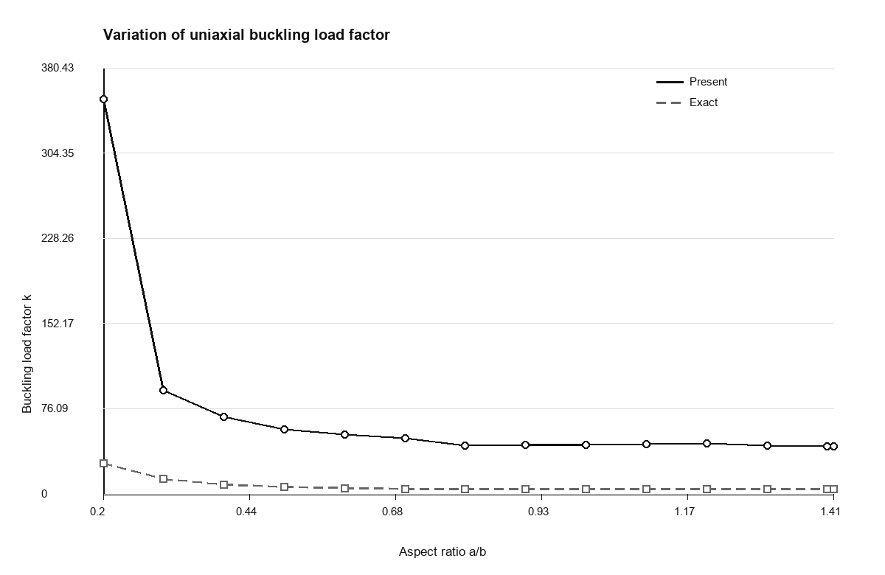
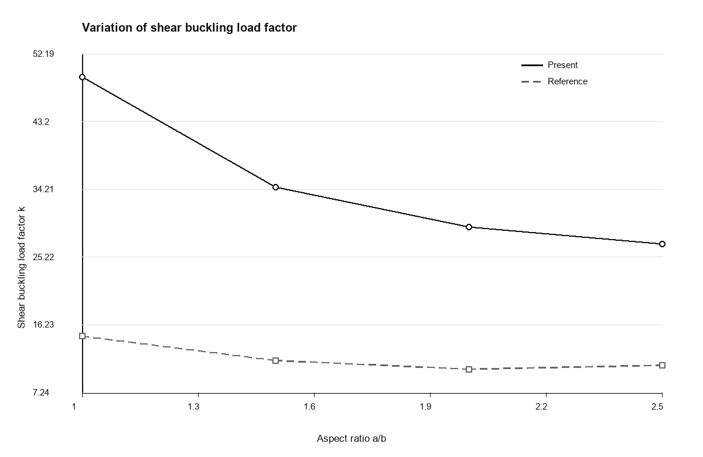
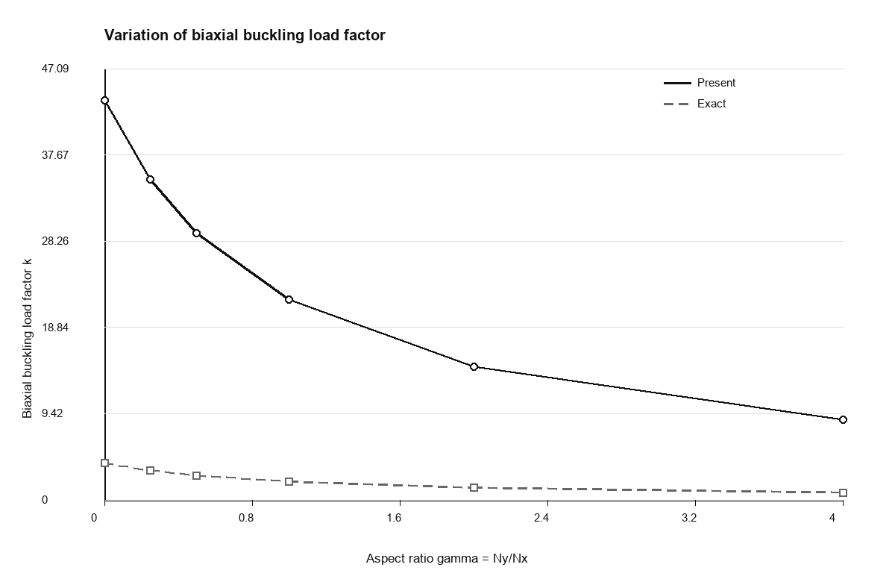
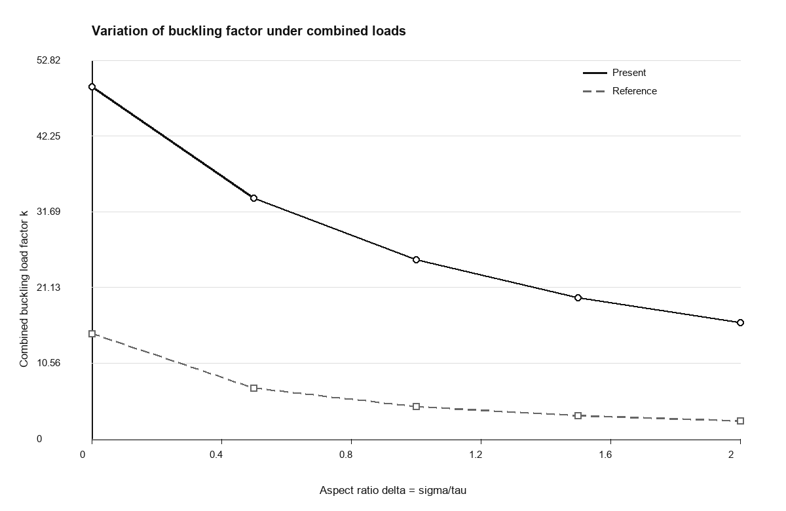

# 仿 Bui et al. 風格的屈曲結果圖表

資料來源為 `Timoshenko/results`。

本報告參考 Bui et al. (2011) 的結果呈現方式：將參考值與本文數值結果並列比較，附上相對誤差欄，並用簡潔線圖展示無因次屈曲係數 `k` 的變化趨勢。

## 圖 1. 四邊簡支矩形板受單軸面內壓縮

| a/b | 節點數 | 解析值 k | 本文 k | 誤差 (%) |
| --- | --- | --- | --- | --- |
| 0.2 | 39 | 27.04 | 352.5498 | 1203.81 |
| 0.3 | 65 | 13.2011 | 92.5459 | 601.0459 |
| 0.4 | 78 | 8.41 | 69 | 720.4518 |
| 0.5 | 91 | 6.25 | 57.7019 | 823.2301 |
| 0.6 | 104 | 5.1378 | 52.8766 | 929.1722 |
| 0.7 | 117 | 4.5308 | 49.6183 | 995.1294 |
| 0.8 | 143 | 4.2025 | 43.1334 | 926.3748 |
| 0.9 | 156 | 4.0446 | 43.5384 | 976.4651 |
| 1 | 169 | 4 | 43.6636 | 991.591 |
| 1.1 | 182 | 4.0364 | 44.5739 | 1004.29 |
| 1.2 | 195 | 4.1344 | 45.1148 | 991.1933 |
| 1.3 | 221 | 4.2817 | 43.1664 | 908.1567 |
| 1.4 | 234 | 4.4702 | 42.3767 | 847.982 |
| 1.41 | 234 | 4.4911 | 42.5441 | 847.2997 |

## 圖 2. 四邊簡支矩形板受純剪切載荷

| a/b | 節點數 | 參考值 k | 本文 k | 誤差 (%) |
| --- | --- | --- | --- | --- |
| 1 | 169 | 14.71 | 49.0902 | 233.7199 |
| 1.5 | 247 | 11.5 | 34.4648 | 199.6941 |
| 2 | 325 | 10.34 | 29.1745 | 182.1517 |
| 2.5 | 403 | 10.85 | 26.9588 | 148.4678 |

## 圖 3. 四邊簡支正方形板受雙軸面內壓縮

| gamma = Ny/Nx | 節點數 | 解析值 k | 本文 k | 誤差 (%) |
| --- | --- | --- | --- | --- |
| 0 | 169 | 4 | 43.6636 | 991.591 |
| 0.25 | 169 | 3.2 | 34.9695 | 992.7984 |
| 0.5 | 169 | 2.6667 | 29.1466 | 992.9976 |
| 1 | 169 | 2 | 21.869 | 993.451 |
| 2 | 169 | 1.3333 | 14.5752 | 993.1387 |
| 4 | 169 | 0.8 | 8.7407 | 992.5851 |

## 圖 4. 四邊簡支正方形板受壓縮與剪切組合載荷

| sigma/tau | 節點數 | 參考值 k | 本文 k | 誤差 (%) |
| --- | --- | --- | --- | --- |
| 0 | 169 | 14.71 | 49.0902 | 233.7199 |
| 0.5 | 169 | 7.09 | 33.6204 | 374.1952 |
| 1 | 169 | 4.5 | 25.0189 | 455.9759 |
| 1.5 | 169 | 3.24 | 19.7345 | 509.09 |
| 2 | 169 | 2.51 | 16.2357 | 546.8416 |

## 說明

- `誤差 (%) = abs(本文 k - 參考值 k) / 參考值 k * 100`。
- 圖件採用接近論文的簡潔學術風格：白色背景、黑色主曲線、灰色虛線作參考曲線，並盡量減少額外裝飾。
- 目前計算得到的 `本文 k` 普遍高於解析值或文獻參考值。這種偏差呈現系統性特徵，較可能與無因次化、載荷縮放或幾何剛度矩陣的尺度設定有關，而不只是繪圖或表格整理問題。
